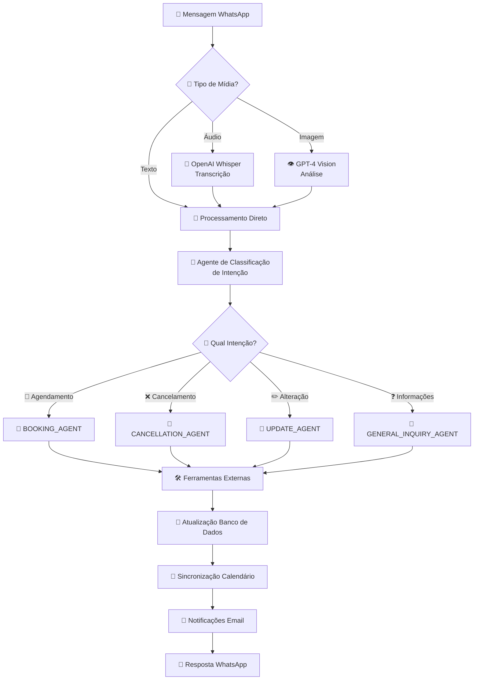
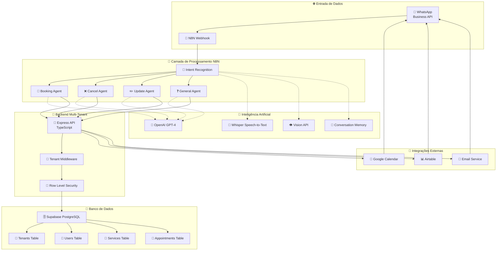
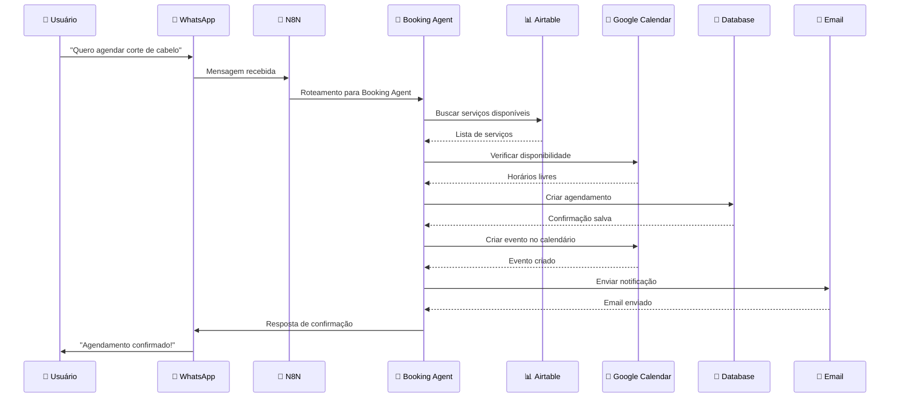
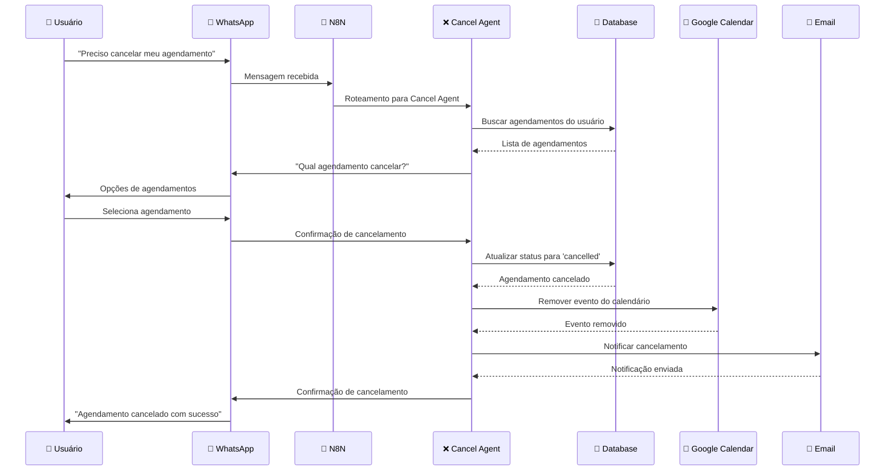
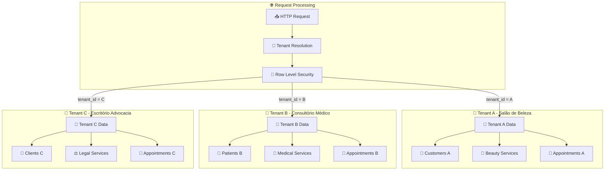
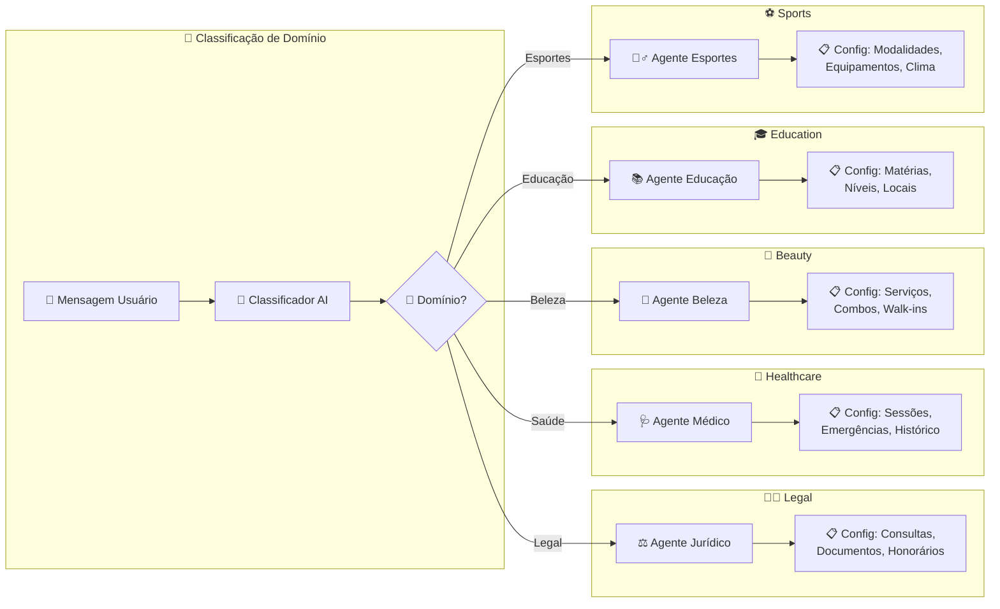
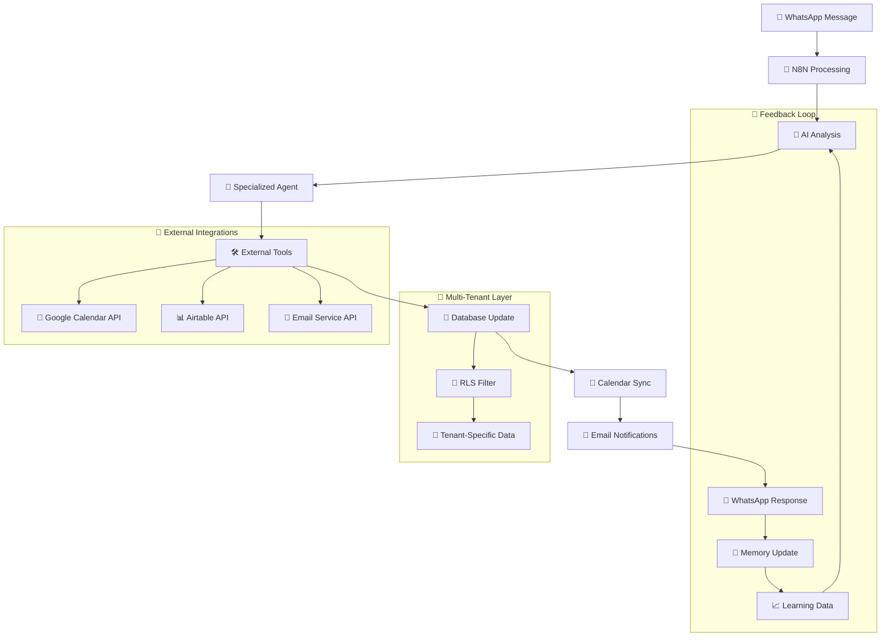

# 🔄 Fluxo Lógico - Sistema Universal de Agendamentos Multi-Tenant

## 📱 Visão Geral do Fluxo Principal

## 🏗️ Arquitetura Técnica Multi-Tenant

## 🎯 Fluxo Detalhado por Agente

### 📅 BOOKING_AGENT - Agendamento

### ❌ CANCELLATION_AGENT - Cancelamento

## 🏢 Isolamento Multi-Tenant

## 🧠 Sistema de IA Especializada

## 📊 Fluxo de Dados Completo

## 🚀 Características Técnicas Principais

### ✅ **Multi-Tenancy Verdadeiro**
- Isolamento completo de dados por `tenant_id`
- Row Level Security (RLS) automático
- Suporte a usuários cross-tenant

### ✅ **IA Especializada por Domínio**
- Agentes configuráveis por tipo de negócio
- Personalidade e terminologia específica
- Triggers de escalação por domínio

### ✅ **Processamento Inteligente de Mídia**
- Transcrição de áudio com Whisper
- Análise de imagem com GPT-4 Vision
- Contexto unificado independente do tipo

### ✅ **Sincronização Multi-Sistema**
- Google Calendar para disponibilidade
- Airtable para dados de serviços
- Database principal para persistência
- Email para notificações

### ✅ **Memória Conversacional**
- Context buffer por sessão
- Histórico de agendamentos
- Preferências do usuário

Este fluxo garante uma experiência automatizada completa, desde a recepção da mensagem até a confirmação final, mantendo isolamento de dados e especialização por domínio de negócio.