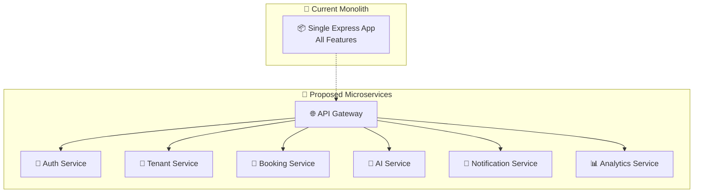

# 🚀 Melhorias e Otimizações - Sistema Universal de Agendamentos

## 📊 **ANÁLISE ATUAL**

### ✅ **Pontos Fortes Identificados**
- Arquitetura multi-tenant bem estruturada
- IA especializada por domínio
- Integração completa WhatsApp + N8N
- TypeScript para type safety
- Row Level Security implementado

### ⚠️ **Gaps e Oportunidades de Melhoria**

## 🏗️ **1. ARQUITETURA E ESCALABILIDADE**

### **A. Microserviços Architecture**


**Benefícios:**
- Escalabilidade independente por serviço
- Deploy isolado e rollback granular
- Times especializados por domínio
- Tolerância a falhas melhorada

### **B. Event-Driven Architecture**
```typescript
// Implementar sistema de eventos
interface DomainEvent {
  id: string
  type: 'appointment.created' | 'appointment.cancelled' | 'user.registered'
  tenantId: string
  payload: any
  timestamp: Date
  version: number
}

// Event Bus com Redis/RabbitMQ
class EventBus {
  async publish(event: DomainEvent): Promise<void>
  async subscribe(eventType: string, handler: EventHandler): Promise<void>
}
```

### **C. Caching Strategy**
```typescript
// Redis Cache Layers
interface CacheStrategy {
  // Nível 1: Response Cache (1-5 min)
  apiResponses: RedisCache
  
  // Nível 2: Data Cache (15-60 min) 
  tenantConfigs: RedisCache
  userProfiles: RedisCache
  serviceDefinitions: RedisCache
  
  // Nível 3: Computed Cache (2-24 hours)
  availabilitySlots: RedisCache
  aiModelResponses: RedisCache
  analyticsData: RedisCache
}
```

## 🧠 **2. INTELIGÊNCIA ARTIFICIAL AVANÇADA**

### **A. Fine-tuned Models por Domínio**
```python
# Treinar modelos específicos
domains = {
    'legal': {
        'model': 'gpt-4-legal-ft',
        'training_data': 'legal_conversations.jsonl',
        'specializations': ['contract_law', 'family_law', 'corporate_law']
    },
    'healthcare': {
        'model': 'gpt-4-medical-ft', 
        'training_data': 'medical_conversations.jsonl',
        'safety_filters': ['crisis_detection', 'medical_advice_limitation']
    }
}
```

### **B. Context-Aware AI Pipeline**
```typescript
interface AIContext {
  conversationHistory: Message[]
  userProfile: UserProfile
  tenantConfig: TenantConfig
  previousAppointments: Appointment[]
  currentDateTime: Date
  businessHours: BusinessHours
  availableServices: Service[]
}

class ContextualAI {
  async processWithContext(message: string, context: AIContext): Promise<AIResponse>
  async updateContext(interaction: Interaction): Promise<void>
  async predictUserIntent(context: AIContext): Promise<PredictedIntent>
}
```

### **C. Multi-Modal AI Enhancement**
```typescript
// Processamento avançado de mídia
interface MediaProcessor {
  // Imagens
  extractTextFromImage(image: Buffer): Promise<string>
  recognizeDocuments(image: Buffer): Promise<DocumentType>
  analyzeEmotions(image: Buffer): Promise<EmotionAnalysis>
  
  // Áudio
  transcribeWithSentiment(audio: Buffer): Promise<TranscriptionWithSentiment>
  detectLanguage(audio: Buffer): Promise<Language>
  analyzeVoiceTone(audio: Buffer): Promise<ToneAnalysis>
  
  // Vídeo
  extractKeyFrames(video: Buffer): Promise<Frame[]>
  generateSummary(video: Buffer): Promise<VideoSummary>
}
```

## 🔐 **3. SEGURANÇA E COMPLIANCE**

### **A. Zero-Trust Security Model**
```typescript
interface SecurityFramework {
  authentication: {
    mfa: boolean
    biometric: boolean
    sessionManagement: 'jwt' | 'oauth2'
    tokenRotation: number // minutes
  }
  
  authorization: {
    rbac: RoleBasedAccess
    abac: AttributeBasedAccess
    rls: RowLevelSecurity
    fieldLevelSecurity: boolean
  }
  
  encryption: {
    atRest: 'AES-256'
    inTransit: 'TLS-1.3'
    endToEnd: boolean
    keyRotation: number // days
  }
}
```

### **B. LGPD/GDPR Compliance**
```typescript
interface DataProtection {
  dataMinimization: {
    retentionPolicy: RetentionPolicy
    automaticDeletion: boolean
    anonymization: boolean
  }
  
  userRights: {
    dataPortability: boolean
    rightToBeDeleted: boolean
    rightToCorrection: boolean
    consentManagement: ConsentManager
  }
  
  auditTrail: {
    dataAccess: DataAccessLog[]
    dataModification: DataModificationLog[]
    userConsent: ConsentLog[]
  }
}
```

### **C. Advanced Monitoring**
```typescript
// Security Monitoring
interface SecurityMonitoring {
  threatDetection: {
    anomalyDetection: boolean
    behaviourAnalysis: boolean
    rateLimit: RateLimitConfig
    botDetection: boolean
  }
  
  compliance: {
    dataFlowMapping: DataFlowMap
    privacyImpactAssessment: boolean
    complianceReporting: ComplianceReport[]
  }
}
```

## 📈 **4. PERFORMANCE E OTIMIZAÇÃO**

### **A. Database Optimization**
```sql
-- Índices Estratégicos
CREATE INDEX CONCURRENTLY idx_appointments_tenant_date 
ON appointments(tenant_id, start_time) 
WHERE status NOT IN ('cancelled', 'completed');

CREATE INDEX CONCURRENTLY idx_users_phone_hash 
ON users USING hash(phone);

-- Particionamento por Tenant
CREATE TABLE appointments_tenant_a PARTITION OF appointments 
FOR VALUES IN ('tenant-a-uuid');

-- Materialized Views para Analytics
CREATE MATERIALIZED VIEW tenant_metrics AS
SELECT 
  tenant_id,
  COUNT(*) as total_appointments,
  AVG(final_price) as avg_price,
  DATE_TRUNC('month', created_at) as month
FROM appointments 
GROUP BY tenant_id, DATE_TRUNC('month', created_at);
```

### **B. API Performance**
```typescript
// GraphQL com DataLoader
interface PerformanceOptimizations {
  graphql: {
    dataLoader: boolean
    queryComplexityAnalysis: boolean
    depthLimiting: number
    rateLimiting: RateLimitConfig
  }
  
  caching: {
    redis: RedisConfig
    cdn: CDNConfig
    applicationCache: CacheConfig
  }
  
  compression: {
    gzip: boolean
    brotli: boolean
    imageOptimization: boolean
  }
}
```

### **C. Real-time Capabilities**
```typescript
// WebSocket para atualizações em tempo real
interface RealTimeFeatures {
  appointmentUpdates: WebSocketChannel
  calendarSync: WebSocketChannel
  agentStatus: WebSocketChannel
  businessMetrics: WebSocketChannel
}

class RealTimeManager {
  async broadcastToTenant(tenantId: string, event: Event): Promise<void>
  async subscribeToUserUpdates(userId: string): Promise<EventStream>
}
```

## 🛠️ **5. DEVELOPMENT EXPERIENCE**

### **A. Testing Strategy**
```typescript
// Comprehensive Testing Pyramid
interface TestingStrategy {
  unit: {
    coverage: 90 // minimum percentage
    framework: 'jest'
    mocking: 'sophisticated'
  }
  
  integration: {
    apiTesting: 'supertest'
    databaseTesting: 'testcontainers'
    externalServices: 'wiremock'
  }
  
  e2e: {
    framework: 'playwright'
    crossBrowser: boolean
    mobileSupport: boolean
  }
  
  performance: {
    loadTesting: 'k6'
    stressTesting: boolean
    memoryProfiling: boolean
  }
}
```

### **B. CI/CD Pipeline Enhancement**
```yaml
# .github/workflows/deploy.yml
name: Enhanced CI/CD Pipeline
on: [push, pull_request]

jobs:
  test:
    runs-on: ubuntu-latest
    services:
      postgres: # Test database
      redis: # Cache testing
    steps:
      - name: Type Check
      - name: Lint & Format
      - name: Unit Tests
      - name: Integration Tests
      - name: Security Scan
      - name: Performance Tests
      
  deploy:
    needs: test
    strategy:
      matrix:
        environment: [staging, production]
    steps:
      - name: Blue-Green Deployment
      - name: Health Checks
      - name: Rollback on Failure
```

### **C. Observability Stack**
```typescript
// OpenTelemetry + Monitoring
interface ObservabilityStack {
  logging: {
    structured: boolean
    correlation: 'traceId'
    levels: LogLevel[]
    centralizedLogging: 'elasticsearch'
  }
  
  metrics: {
    businessMetrics: BusinessMetric[]
    technicalMetrics: TechnicalMetric[]
    customDashboards: Dashboard[]
    alerting: AlertConfig[]
  }
  
  tracing: {
    distributedTracing: boolean
    sampling: SamplingConfig
    spanProcessing: SpanProcessor[]
  }
}
```

## 📱 **6. MOBILE E UX IMPROVEMENTS**

### **A. Progressive Web App**
```typescript
// PWA para Dashboard Admin
interface PWAFeatures {
  offlineSupport: boolean
  pushNotifications: boolean
  backgroundSync: boolean
  installPrompt: boolean
  
  mobileOptimizations: {
    touchGestures: boolean
    responsiveDesign: boolean
    darkMode: boolean
    accessibility: 'WCAG-AA'
  }
}
```

### **B. WhatsApp Business API v2**
```typescript
// Recursos avançados do WhatsApp
interface WhatsAppAdvanced {
  interactiveMessages: {
    buttons: boolean
    lists: boolean
    carousel: boolean
    quickReplies: boolean
  }
  
  richMedia: {
    voiceMessages: boolean
    videoMessages: boolean
    documentSharing: boolean
    locationSharing: boolean
  }
  
  automation: {
    chatbotFlows: boolean
    humanHandover: boolean
    sentimentAnalysis: boolean
    intentRecognition: boolean
  }
}
```

## 💰 **7. BUSINESS INTELLIGENCE**

### **A. Advanced Analytics**
```typescript
interface AnalyticsPlatform {
  realTimeMetrics: {
    appointmentVelocity: number
    conversionRates: ConversionMetric[]
    revenueTracking: RevenueMetric[]
    customerSatisfaction: SatisfactionScore
  }
  
  predictiveAnalytics: {
    demandForecasting: boolean
    churnPrediction: boolean
    revenueProjection: boolean
    seasonalityAnalysis: boolean
  }
  
  businessIntelligence: {
    customReports: Report[]
    kpiDashboards: Dashboard[]
    benchmarking: BenchmarkData
    competitiveAnalysis: boolean
  }
}
```

### **B. Multi-Tenant Analytics**
```sql
-- Analytics por Tenant com Privacy
CREATE VIEW tenant_analytics AS
SELECT 
  t.id as tenant_id,
  t.business_name,
  COUNT(a.id) as total_appointments,
  AVG(a.final_price) as avg_revenue,
  COUNT(DISTINCT a.user_id) as unique_customers,
  -- Métricas anonimizadas
  percentile_cont(0.5) WITHIN GROUP (ORDER BY a.final_price) as median_revenue
FROM tenants t
LEFT JOIN appointments a ON t.id = a.tenant_id
WHERE a.created_at >= CURRENT_DATE - INTERVAL '30 days'
GROUP BY t.id, t.business_name;
```

## 🔄 **8. IMPLEMENTATION ROADMAP**

### **Fase 1: Foundation (1-2 meses)**
1. ✅ Setup completo de testes automatizados
2. ✅ Implementação de cache Redis
3. ✅ Monitoring básico com logs estruturados
4. ✅ Security audit e correções críticas

### **Fase 2: Performance (2-3 meses)**
1. 🔄 Database optimization e índices
2. 🔄 API rate limiting e throttling
3. 🔄 CDN setup para assets estáticos
4. 🔄 Real-time features com WebSocket

### **Fase 3: Intelligence (3-4 meses)**
1. 🆕 Fine-tuned AI models por domínio
2. 🆕 Advanced context awareness
3. 🆕 Predictive analytics
4. 🆕 Multi-modal AI processing

### **Fase 4: Scale (4-6 meses)**
1. 🚀 Microservices migration
2. 🚀 Event-driven architecture
3. 🚀 Advanced security framework
4. 🚀 Business intelligence platform

## 💡 **PRIORIDADES RECOMENDADAS**

### **🔥 High Priority (Crítico)**
1. **Testing Framework** - Base para qualidade
2. **Security Audit** - Proteção de dados
3. **Performance Monitoring** - Escalabilidade
4. **Cache Implementation** - User experience

### **🎯 Medium Priority (Importante)**
1. **Real-time Features** - Competitive advantage
2. **Advanced AI** - Diferenciação
3. **Analytics Platform** - Business insights
4. **Mobile PWA** - Accessibility

### **📈 Low Priority (Futuro)**
1. **Microservices** - Scale optimization
2. **Predictive Analytics** - Advanced features
3. **Multi-region** - Global expansion
4. **White-label** - Partner ecosystem

## 📊 **ROI ESPERADO**

- **Performance**: 40-60% redução no tempo de resposta
- **Reliability**: 99.9% uptime com monitoring adequado
- **Security**: Compliance total LGPD/GDPR
- **Development**: 50% redução em bugs com testing
- **Business**: 25-35% aumento em conversão com AI melhorada

Essas melhorias transformariam o sistema em uma plataforma enterprise-ready, escalável e competitiva no mercado de automação de agendamentos.