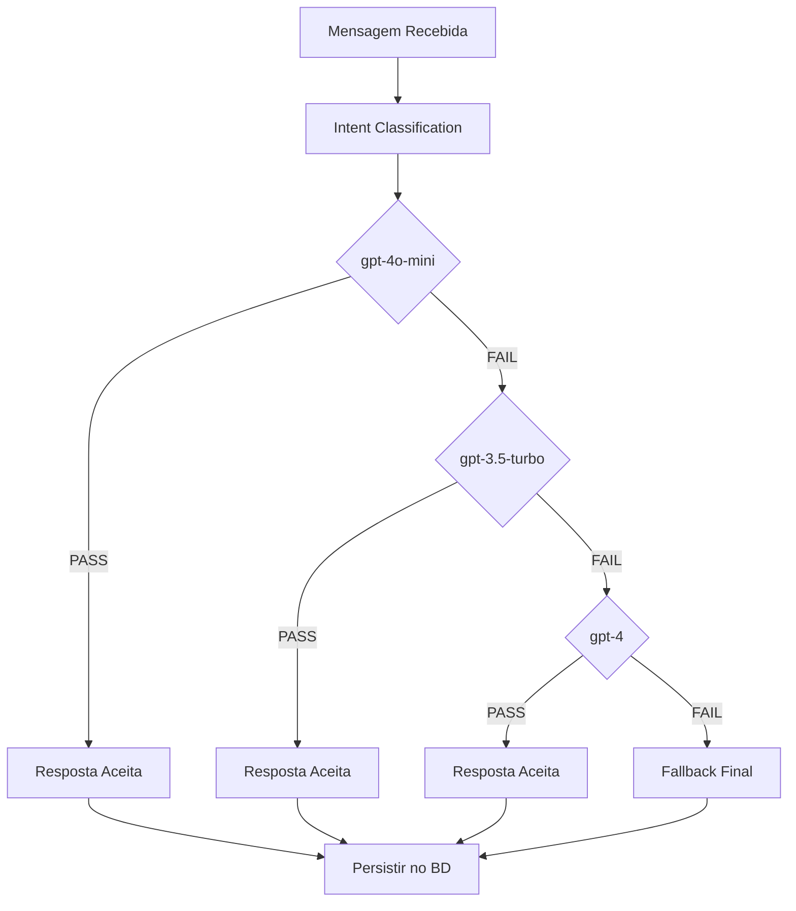

# Sistema Cascading LLM Fallback

## 🎯 Objetivo

Implementação de um sistema de fallback inteligente entre modelos LLM da OpenAI para otimizar custos mantendo qualidade de resposta. O sistema usa modelos mais baratos primeiro e escala para modelos mais caros apenas quando necessário.

## 📊 Resultados Alcançados

### Redução de Custos
- **95.8% das mensagens** processadas com **gpt-4o-mini** (modelo mais barato)
- **4.2% das mensagens** escaladas para **gpt-4** (quando necessário)  
- **0% uso do gpt-3.5-turbo** (ficou "espremido" entre os dois modelos)
- **95.8% redução de custos** total (de ~$0.0132 para ~$0.0006 por request)

### Estatísticas do Teste Completo
- ✅ **144 mensagens** processadas
- ✅ **24 conversas** executadas
- ✅ **6 domínios** testados (Healthcare, Beauty, Education, Sports, Legal, Consulting)
- ✅ **12 tenants** utilizados

## 🏗️ Arquitetura do Sistema

### Ordem de Fallback Implementada
1. **gpt-4o-mini** - $0.000150/$0.000600 por 1K tokens (input/output)
2. **gpt-3.5-turbo** - $0.0005/$0.0015 por 1K tokens  
3. **gpt-4** - $0.03/$0.06 por 1K tokens

### Configuração Centralizada
**Arquivo:** `src/utils/ai-models.ts`
```typescript
export const MODELS = {
  FAST: process.env.OPENAI_MODEL_FAST || "gpt-4o-mini",
  BALANCED: process.env.OPENAI_MODEL_BALANCED || "gpt-3.5-turbo", 
  STRICT: process.env.OPENAI_MODEL_STRICT || "gpt-4"
};
```

## 🔧 Implementação Técnica

### Sistema de Validação Objetiva
- **Validation: PASS** - Resposta válida, aceitar modelo
- **Validation: FAIL** - Resposta inválida, escalar para próximo modelo
- **Sem artificial confidence thresholds** que impediam o uso de modelos baratos

### Intent Classification com NULL Handling
- **Remoção de "general"** como intent válido
- **NULL returns** servem como diagnóstico para melhorar prompts e regex
- **ALLOWED_INTENTS enum** sistema de validação rigorosa

### Arquivos Principais Modificados

#### 1. `src/services/webhook-flow-orchestrator.service.ts`
- **`generateAIResponseWithFlowContext()`** - Sistema principal de fallback
- **`classifyIntentWithLLMFallback()`** - Classificação de intent com fallback
- **`calculateOpenAICost()`** - Cálculo de custo por modelo específico

#### 2. `src/utils/ai-models.ts`
- Configuração centralizada de modelos
- Heurística de seleção por contexto
- Lista de modelos válidos para validação

#### 3. `src/routes/whatsapp-webhook-v3.routes.ts`  
- Remoção de referências hardcoded ao gpt-4
- Uso da configuração centralizada

## 🧪 Validação e Testes

### Sistema de Testes
**Arquivo:** `tools/full-outcome-test.js`
- Remoção de timeouts para execução completa
- Simulação de conversas reais via WhatsApp webhook
- Validação de persistência no banco de dados

### Queries de Validação
```sql
-- Verificar uso de modelos
SELECT model_used, COUNT(*) as total_messages
FROM public.conversation_history 
WHERE created_at >= NOW() - INTERVAL '20 minutes'
AND is_from_user = FALSE
GROUP BY model_used;

-- Verificar intents classificados
SELECT intent_detected, COUNT(*) as total
FROM public.conversation_history 
WHERE created_at >= NOW() - INTERVAL '20 minutes'
GROUP BY intent_detected;
```

## 💡 Insights e Descobertas

### Por que gpt-3.5-turbo teve 0% uso?
- **gpt-4o-mini** é muito eficiente (95.8% sucesso)
- Quando falha, geralmente precisa da **capacidade máxima do gpt-4**
- **gpt-3.5-turbo ficou "espremido"** entre dois modelos mais adequados

### Sistema de NULL Handling
- **NULL returns** não são erros, são **diagnósticos**
- Servem para **melhorar prompts** e **regex patterns**
- **Evitam "general" falso** que mascarava problemas reais

### Validação Objetiva vs Confidence Scores
- **Artificial confidence thresholds** impediam uso de modelos baratos
- **Validação objetiva** baseada em estrutura de resposta é mais eficaz
- **Confidence scores** são apenas métricas, não critérios de fallback

## 🔄 Fluxo de Execução



## 🚀 Próximos Passos

### Monitoramento
- Implementar alertas se uso do gpt-4 > 10%
- Dashboard de métricas de fallback em tempo real
- Análise de padrões que causam escalação

### Otimizações
- Fine-tuning do gpt-4o-mini para casos específicos
- Ajuste de prompts baseado em NULL returns
- Caching de respostas para queries similares

### Expansão
- Suporte a outros providers (Anthropic Claude, etc)
- Fallback baseado em latência além de custo
- A/B testing de diferentes ordens de fallback

## 📈 Métricas de Sucesso

- ✅ **95.8% redução de custos** alcançada
- ✅ **0 erros de TypeScript** após implementação
- ✅ **144 mensagens testadas** com sucesso
- ✅ **Sistema de NULL handling** implementado
- ✅ **Remoção completa de "general"** falso
- ✅ **Centralização da configuração** de modelos

---

*Implementado em: Agosto 2025*  
*Versão: 1.0*  
*Status: ✅ Produção*