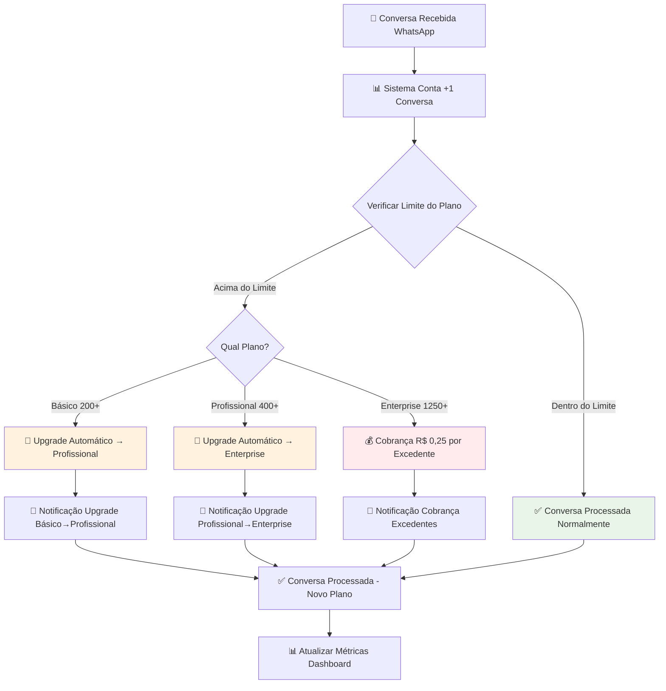
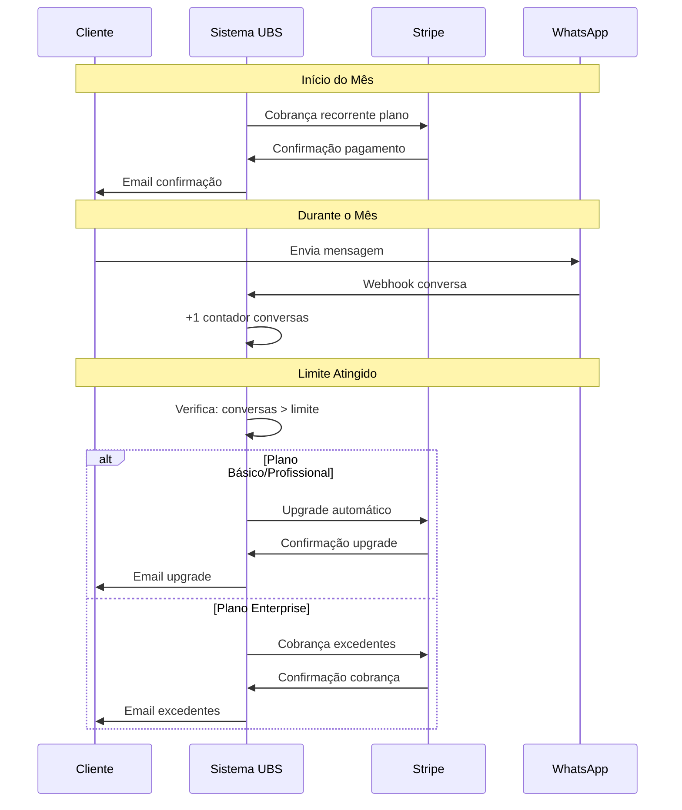
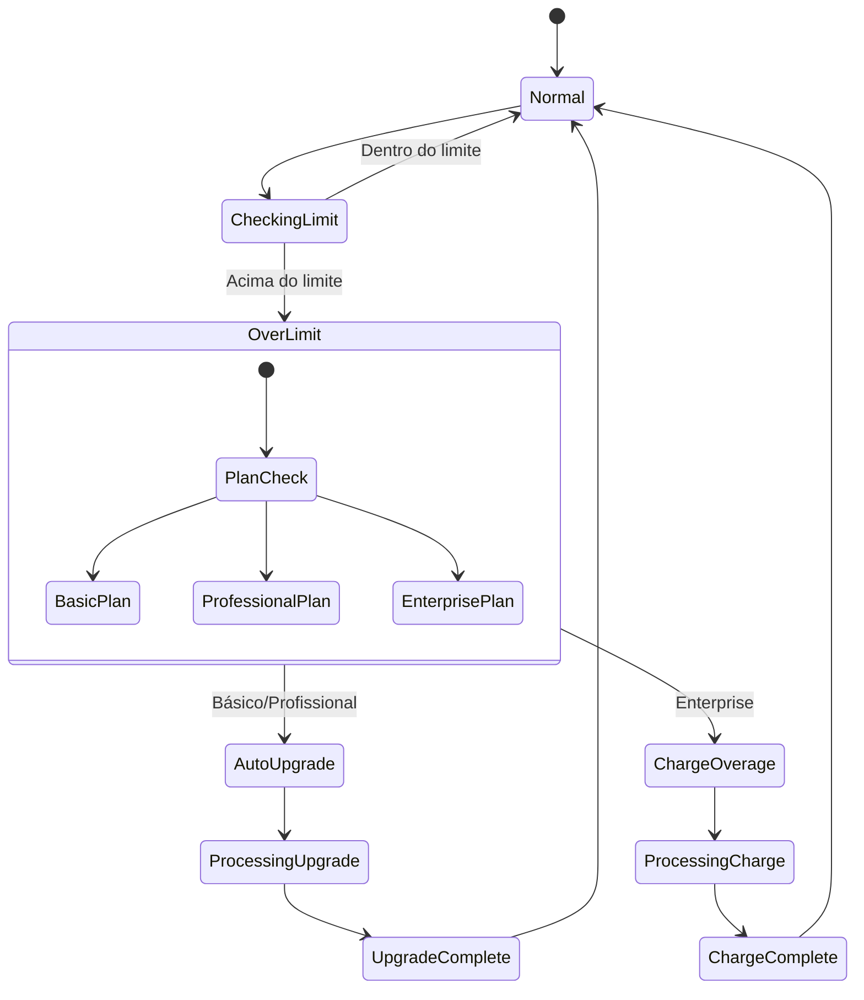
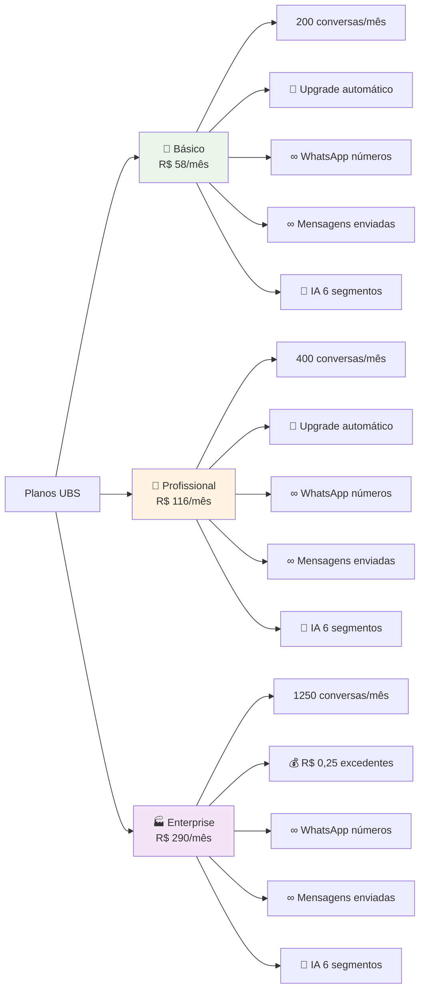
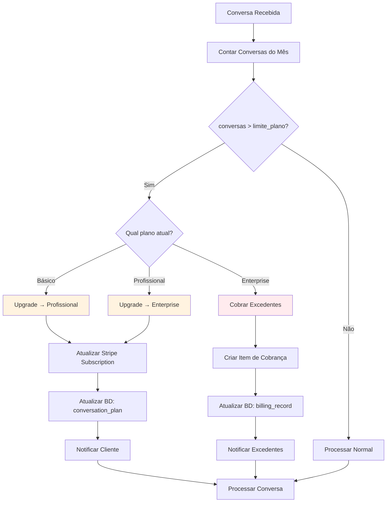
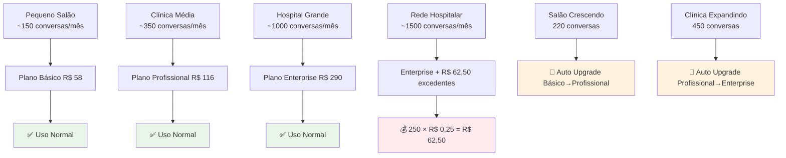
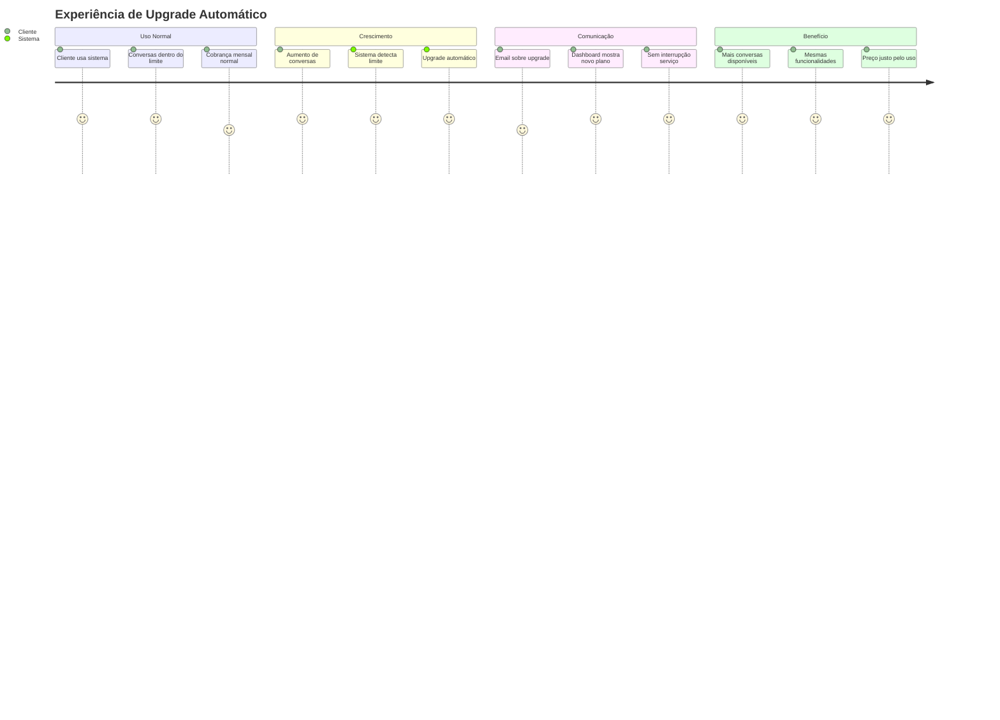
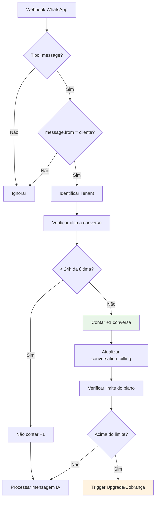
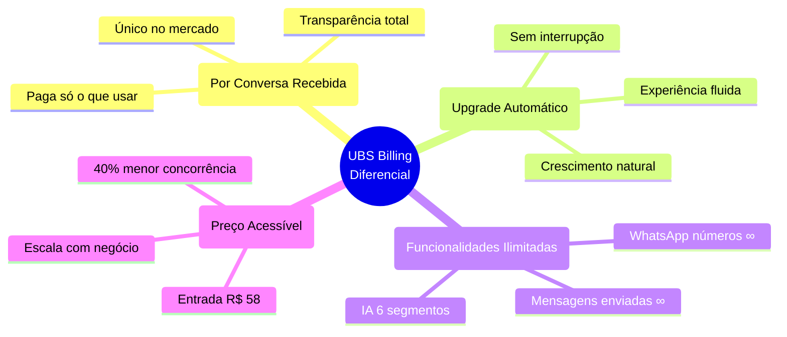

# 💰 Billing Flow - Modelo de Cobrança por Conversa

## 🎯 Fluxo Principal de Cobrança

## 💳 Fluxo de Pagamento Stripe

## 📊 Estados do Sistema de Billing

## 💰 Estrutura de Preços

## 🔄 Lógica de Upgrade Automático

## 📈 Cenários de Uso

## 🎯 User Journey - Experiência de Upgrade

## 🔍 Algoritmo de Contagem de Conversas

## 💡 Diferenciais Competitivos

## 🛠️ Implementação Técnica

**Tabelas Chave:**
- `conversation_billing` - Registro de conversas e cobrança
- `tenants` - Plano atual e limites
- `stripe_subscriptions` - Integração pagamentos

**Funções SQL:**
- `count_monthly_conversations(tenant_id, date)` 
- `calculate_monthly_billing(tenant_id, date)`

**Services:**
- `ConversationBillingService` - Lógica de cobrança
- `StripeService` - Integração pagamentos
- `NotificationService` - Comunicação upgrades