# 📊 Análise Completa - Dashboard Super Admin UBS

## 🎯 Visão Geral
O dashboard-standardized.html é a **página principal de administração** do sistema UBS, projetada especificamente para **Super Admins** visualizarem métricas de toda a plataforma.

---

## 🏗️ Estrutura Técnica

### **Headers e Dependencies**
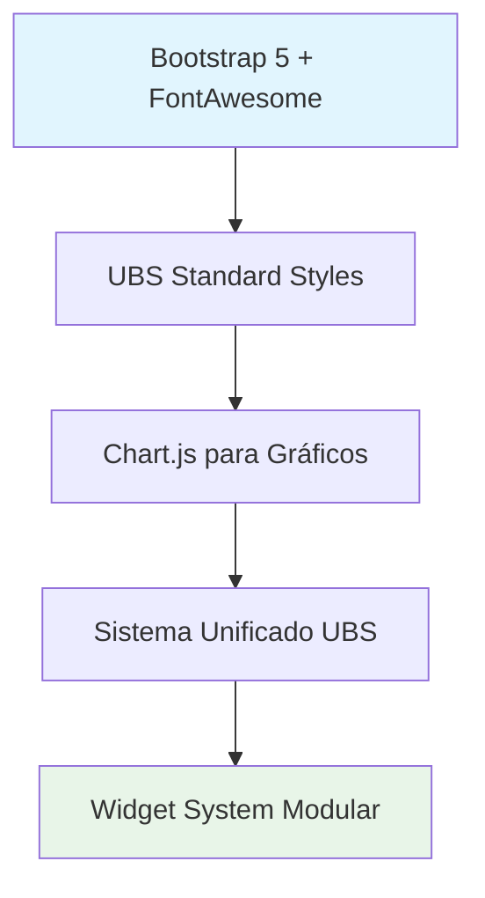

### **Arquitetura de Scripts**
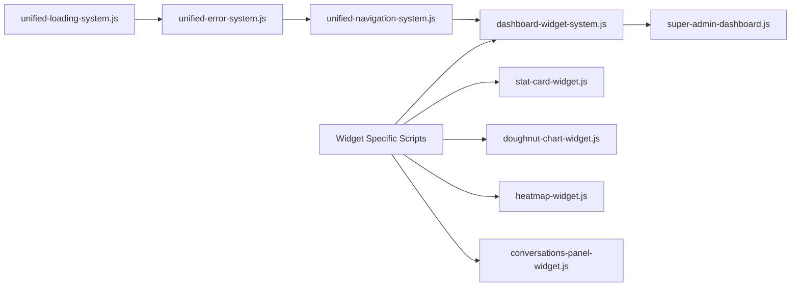

---

## 📱 Componentes de Interface

### **1. SIDEBAR NAVIGATION**
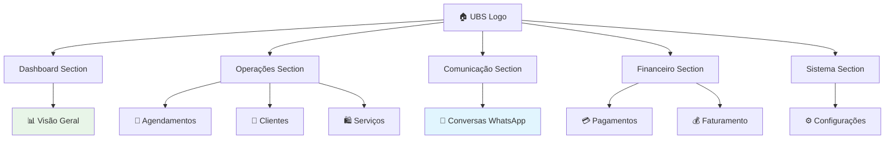

**Funcionalidades:**
- ✅ Navigation responsiva (mobile/desktop)
- ✅ Sidebar colapsável
- ✅ Active state por URL
- ✅ Logo adaptativo

### **2. TOP NAVIGATION BAR**
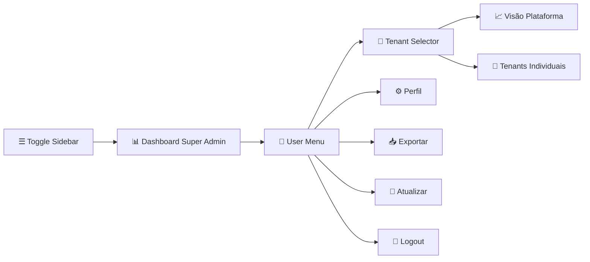

**Funcionalidades:**
- ✅ User authentication display
- ✅ Tenant switching (Platform vs Individual)
- ✅ Export functionality
- ✅ Real-time refresh
- ✅ Secure logout

---

## 📊 Seções Principais do Dashboard

### **SEÇÃO 1: QUICK ACTIONS**
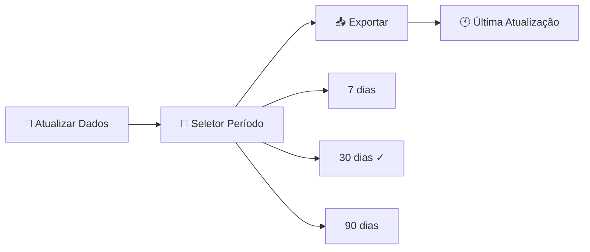

**Funcionalidades:**
- ✅ Refresh manual dos dados
- ✅ Filtro temporal (7/30/90 dias)
- ✅ Export de dados
- ✅ Timestamp de atualização

### **SEÇÃO 2: KPIs ESTRATÉGICOS (8 Métricas)**
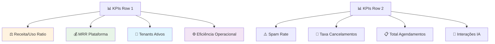

**Cada KPI contém:**
- ✅ Valor atual formatado
- ✅ Título e descrição
- ✅ Trend indicator (↑↓→)
- ✅ Ícone temático colorido

### **SEÇÃO 3: PERFORMANCE E ANÁLISE (4 Gráficos)**
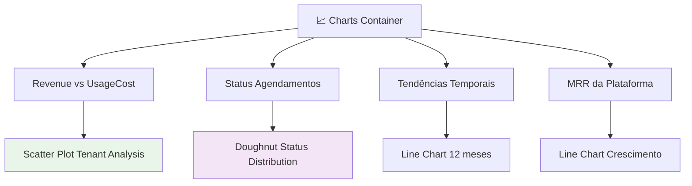

**Funcionalidades:**
- ✅ Charts interativos (Chart.js)
- ✅ Tooltips informativos
- ✅ Responsive design
- ✅ Color coding por performance

### **SEÇÃO 4: INSIGHTS ESTRATÉGICOS (3 Tabelas)**
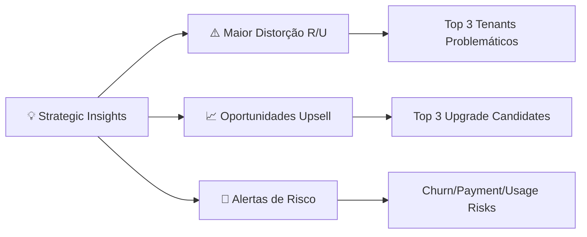

**Funcionalidades:**
- ✅ Dynamic content loading
- ✅ Color-coded risk levels
- ✅ Revenue optimization focus
- ✅ Actionable insights

### **SEÇÃO 5: ANÁLISE DETALHADA (Tabela Principal)**
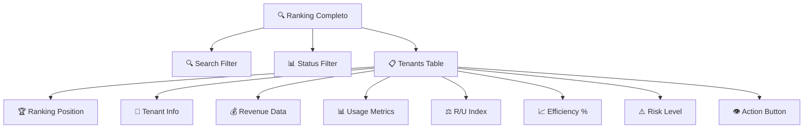

**Colunas da Tabela:**
1. **Ranking** - Posição competitiva
2. **Tenant** - Nome + Plano atual
3. **Receita Mensal** - Valor em R$
4. **Uso Real** - Percentual do plano
5. **Índice R/U** - Revenue/Usage ratio
6. **Eficiência** - Performance score
7. **Risco** - Churn/payment risk
8. **Ações** - View details button

---

## ⚙️ Funcionalidades Técnicas

### **Autenticação e Segurança**
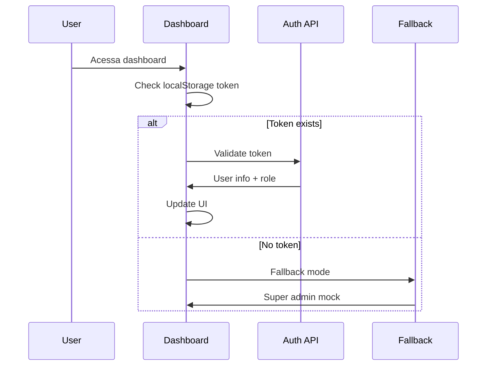

**Características:**
- ✅ JWT token validation
- ✅ Role-based access (super_admin/tenant_admin)
- ✅ Fallback mode para desenvolvimento
- ✅ Secure token decode
- ✅ Auto-redirect protection

### **Sistema de Dados**
```mermaid
graph TD
    A[🔄 Data Loading] --> B[📊 KPIs API]
    A --> C[📈 Charts API]
    A --> D[💡 Insights API]
    A --> E[🏢 Tenants API]
    
    B --> F[/api/super-admin/kpis]
    C --> G[/api/super-admin/charts/*]
    D --> H[/api/super-admin/insights/*]
    E --> I[/api/tenant-platform/tenants]
    
    F --> J[Update KPI Cards]
    G --> K[Render Charts]
    H --> L[Populate Tables]
    I --> M[Tenant Dropdown]
```

**APIs Utilizadas:**
- `/api/super-admin/kpis?period=30`
- `/api/super-admin/charts/revenue-vs-usage-cost`
- `/api/super-admin/charts/appointment-status`
- `/api/super-admin/insights/distortion`
- `/api/super-admin/insights/upsell`
- `/api/tenant-platform/tenants`

### **Auto-Refresh System**
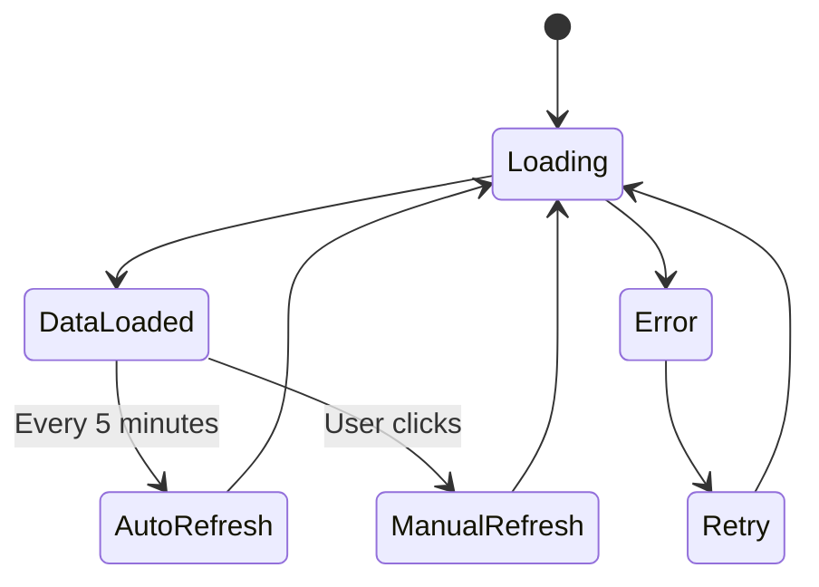

**Características:**
- ✅ Auto-refresh a cada 5 minutos
- ✅ Manual refresh button
- ✅ Loading states
- ✅ Error handling
- ✅ Timestamp tracking

---

## 🎨 Sistema de Widgets

### **Widget Architecture**
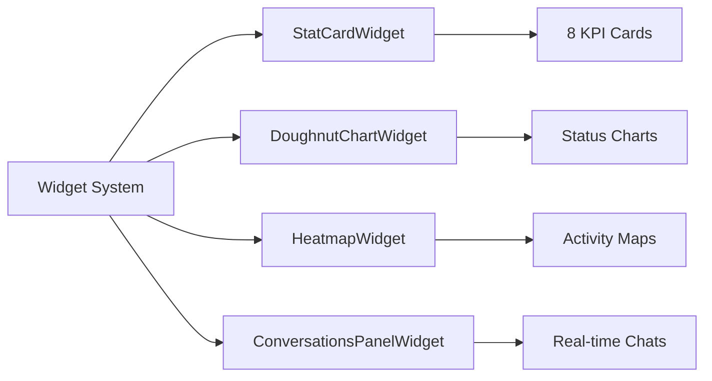

**Funcionalidades dos Widgets:**
- ✅ Modular e reutilizável
- ✅ Error handling integrado
- ✅ Loading states
- ✅ Responsive design
- ✅ Fallback systems

---

## 📱 Responsividade

### **Breakpoints e Comportamento**
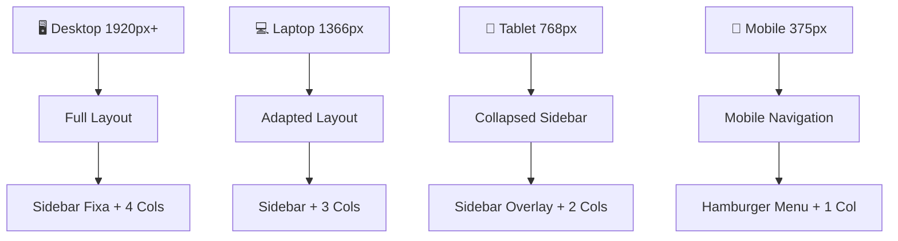

**Características:**
- ✅ Mobile-first design
- ✅ Sidebar overlay em mobile
- ✅ Grid adaptativo
- ✅ Touch-friendly buttons

---

## 🎯 Fluxos de Interação

### **Tenant Switching Flow**
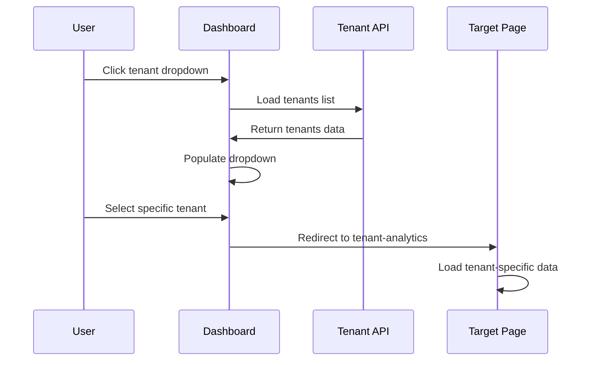

### **Data Export Flow**
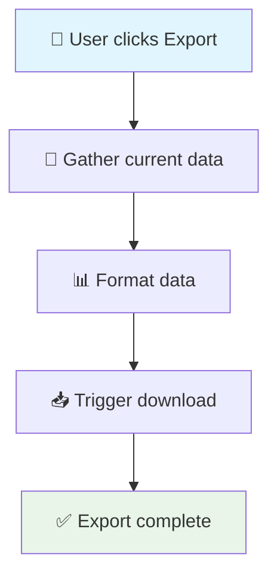

---

## 💡 Insights de Performance

### **Métricas Críticas Monitoradas:**
1. **Revenue/Usage Ratio** - Eficiência financeira
2. **MRR Platform** - Crescimento da receita
3. **Active Tenants** - Base de clientes
4. **Operational Efficiency** - Conversão agendamentos
5. **Spam Rate** - Qualidade das conversas
6. **Cancellation Rate** - Satisfação do cliente
7. **Total Appointments** - Volume de negócios
8. **AI Interactions** - Automação efetiva

### **Análises Estratégicas:**
- **Distortion Analysis** - Tenants pagando mais que usam
- **Upsell Opportunities** - Tenants usando mais que pagam
- **Risk Alerts** - Churn, pagamento, uso decrescente
- **Tenant Ranking** - Performance comparativa

---

## 🛠️ Customizações e Extensibilidade

### **Sistema Modular:**
- Widget system permite fácil adição de novos componentes
- API endpoints padronizados
- CSS modular com variáveis UBS
- JavaScript componentizado

### **Pontos de Extensão:**
- Novos KPIs podem ser adicionados facilmente
- Charts adicionais via Chart.js
- Filtros customizáveis
- Export formats configuráveis

---

**Este dashboard é a central de controle completa para Super Admins gerenciarem toda a plataforma UBS, com foco em métricas financeiras, performance operacional e insights estratégicos para crescimento da plataforma.**