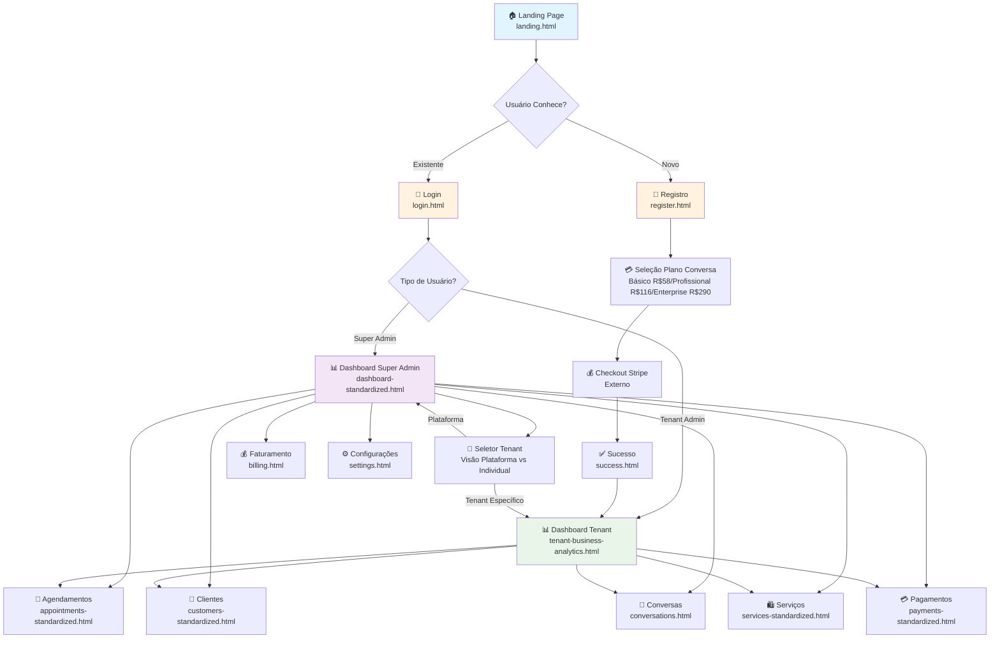
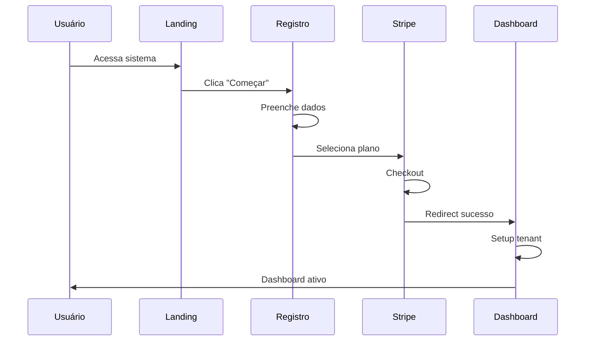
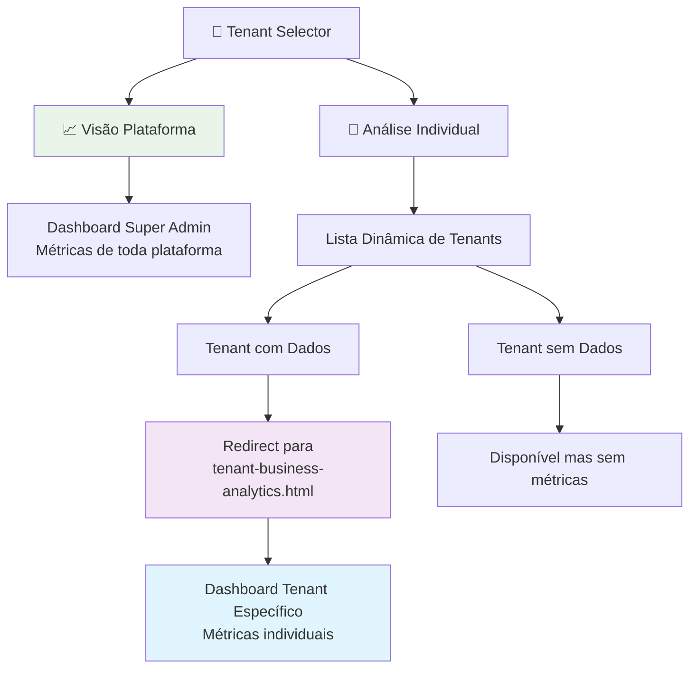
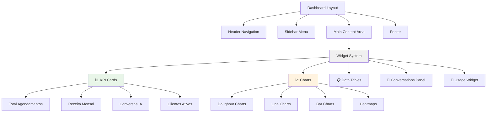
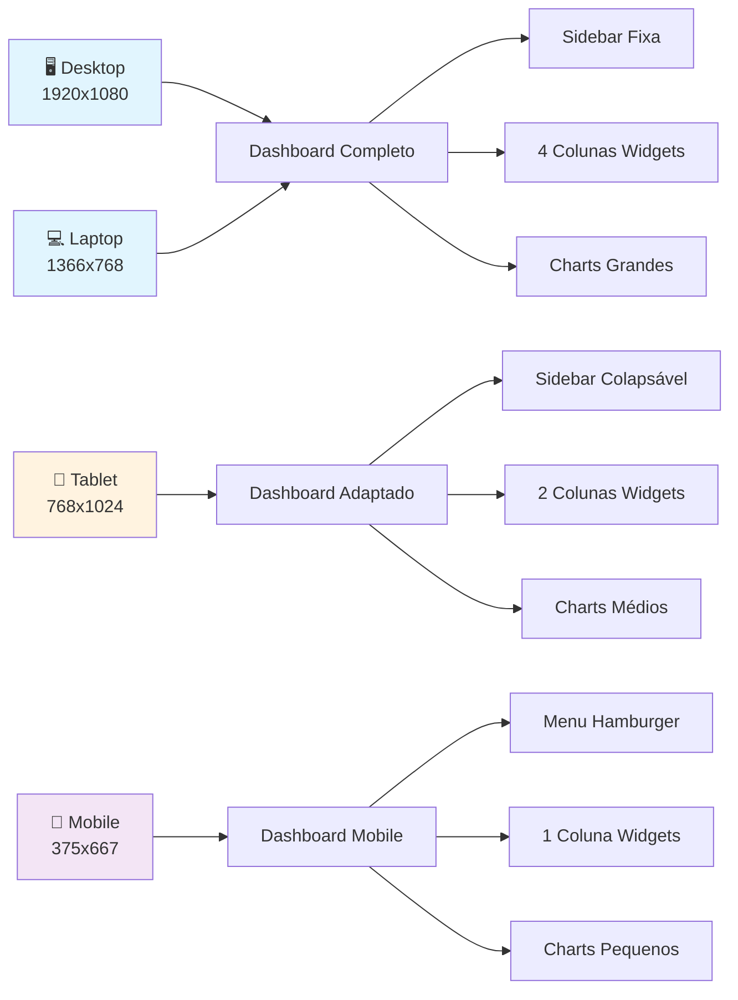
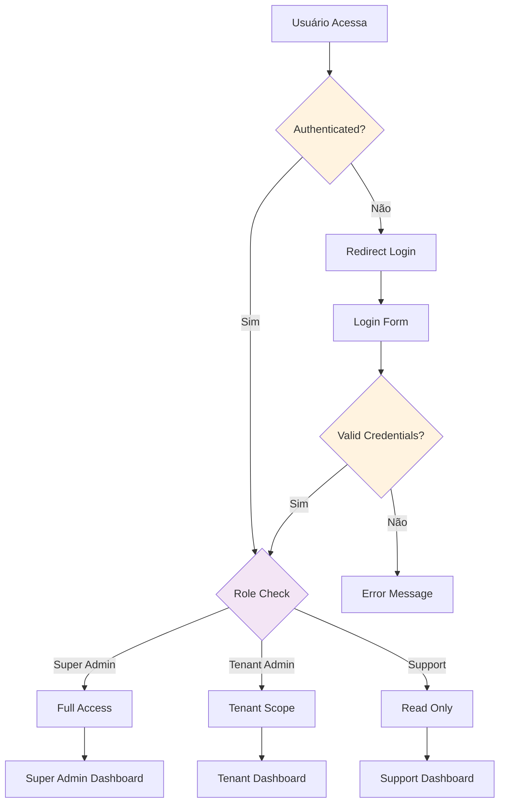
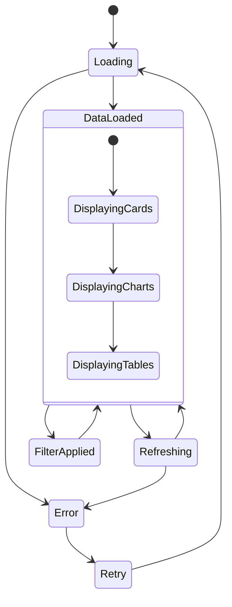
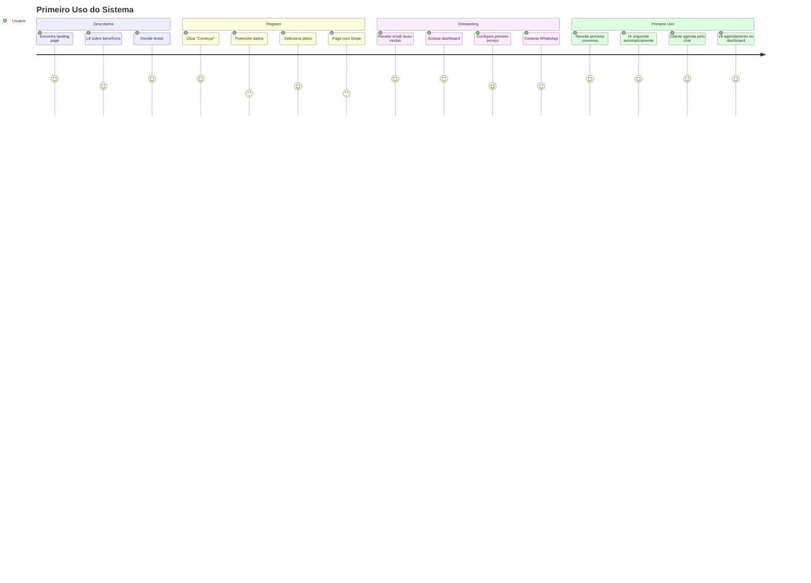

# 📱 Frontend Page Flow - UBS System (REAL ANALYSIS)

## 🎯 Fluxo Principal de Páginas



## 🔄 Fluxo de Autenticação



## 📊 Dashboard Super Admin - Seções Principais

```mermaid
graph TD
    A[📊 Dashboard Super Admin] --> B[⚡ Quick Actions]
    A --> C[📈 KPIs Estratégicos - 8 Métricas]
    A --> D[📊 Performance e Análise - 4 Gráficos]
    A --> E[💡 Insights Estratégicos - 3 Tabelas]
    A --> F[🔍 Análise Detalhada - Ranking]
    
    B --> B1[🔄 Atualizar Dados]
    B --> B2[📅 Período: 7/30/90 dias]
    B --> B3[📥 Exportar Dados]
    
    C --> C1[⚖️ Receita/Uso Ratio]
    C --> C2[💰 MRR Plataforma]
    C --> C3[🏢 Tenants Ativos]
    C --> C4[⚙️ Eficiência Operacional]
    C --> C5[⚠️ Spam Rate]
    C --> C6[📅 Taxa Cancelamentos]
    C --> C7[📋 Total Agendamentos]
    C --> C8[🤖 Interações IA]
    
    D --> D1[📈 Revenue vs UsageCost Scatter]
    D --> D2[🍩 Status Agendamentos Doughnut]
    D --> D3[📊 Tendências Temporais Line]
    D --> D4[💰 MRR Crescimento Line]
    
    E --> E1[⚠️ Maior Distorção R/U]
    E --> E2[📈 Oportunidades Upsell]
    E --> E3[🚨 Alertas de Risco]
    
    F --> F1[🏆 Ranking Tenants]
    F --> F2[🔍 Filtros Busca/Status]
    F --> F3[📊 Métricas Comparativas]
    
    style A fill:#e8f5e8
    style C fill:#f3e5f5
    style D fill:#e1f5fe
    style E fill:#fff3e0
    style F fill:#fce4ec
```



## 🏢 Tenant Selector - Funcionalidade Chave



## 🎨 Componentes e Widgets



## 📱 Responsividade



## 🔒 Controle de Acesso



## 📊 Estados de Dados



## 🎯 User Journey - Primeiro Uso



## 🔧 Ferramentas de Desenvolvimento

Para visualizar estes diagramas:

1. **VS Code**: Instale extensão "Mermaid Preview"
2. **Online**: Cole código em [mermaid.live](https://mermaid.live)
3. **CLI**: 
```bash
npm install -g @mermaid-js/mermaid-cli
mmdc -i frontend-page-flow.md -o frontend-flow.png
```