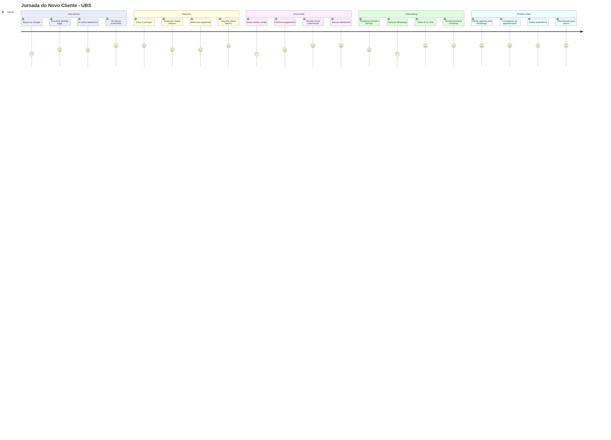
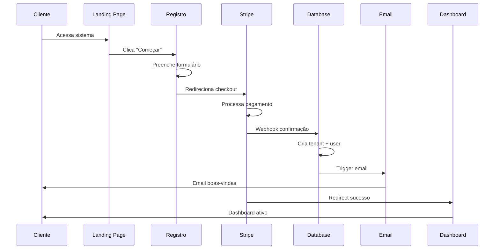
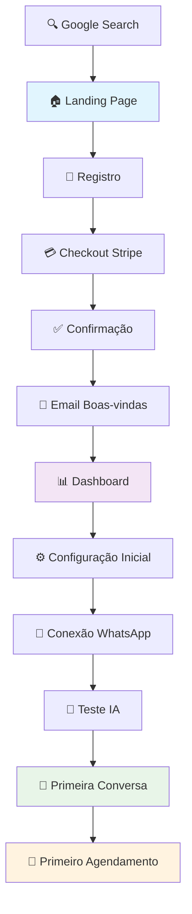
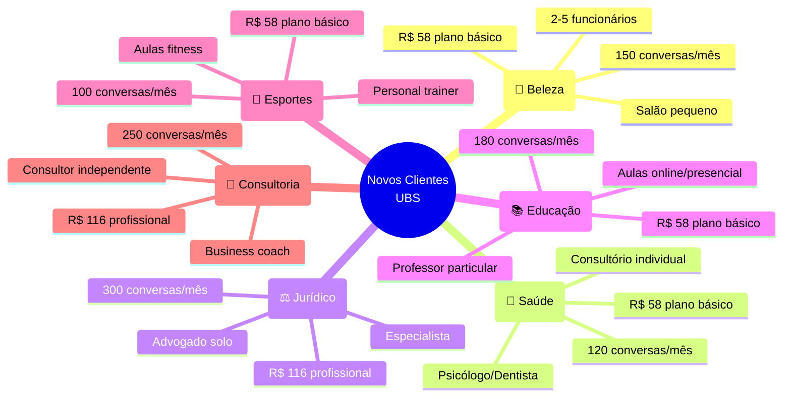
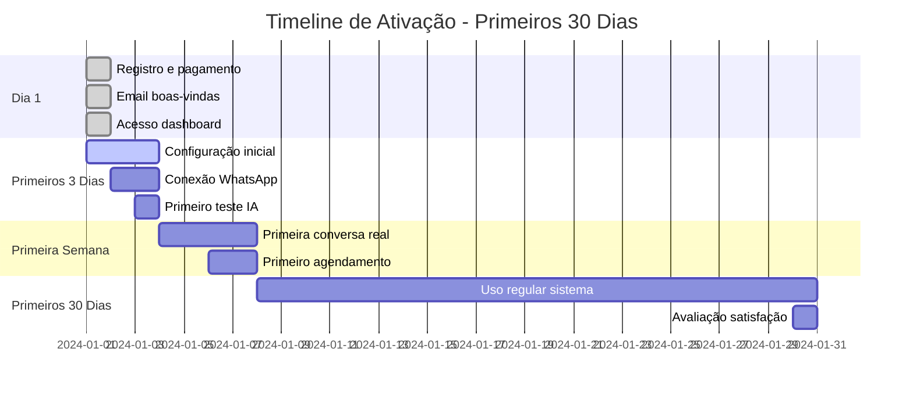
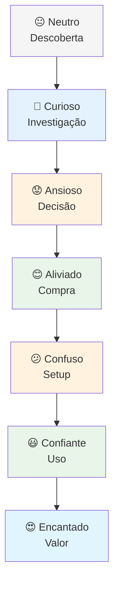
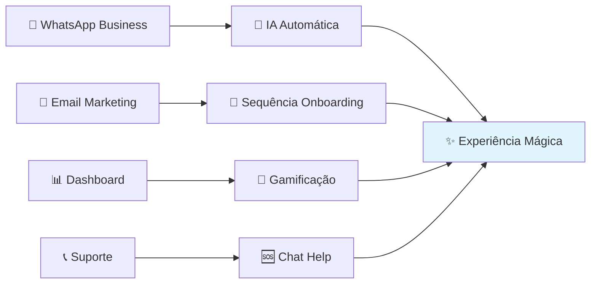
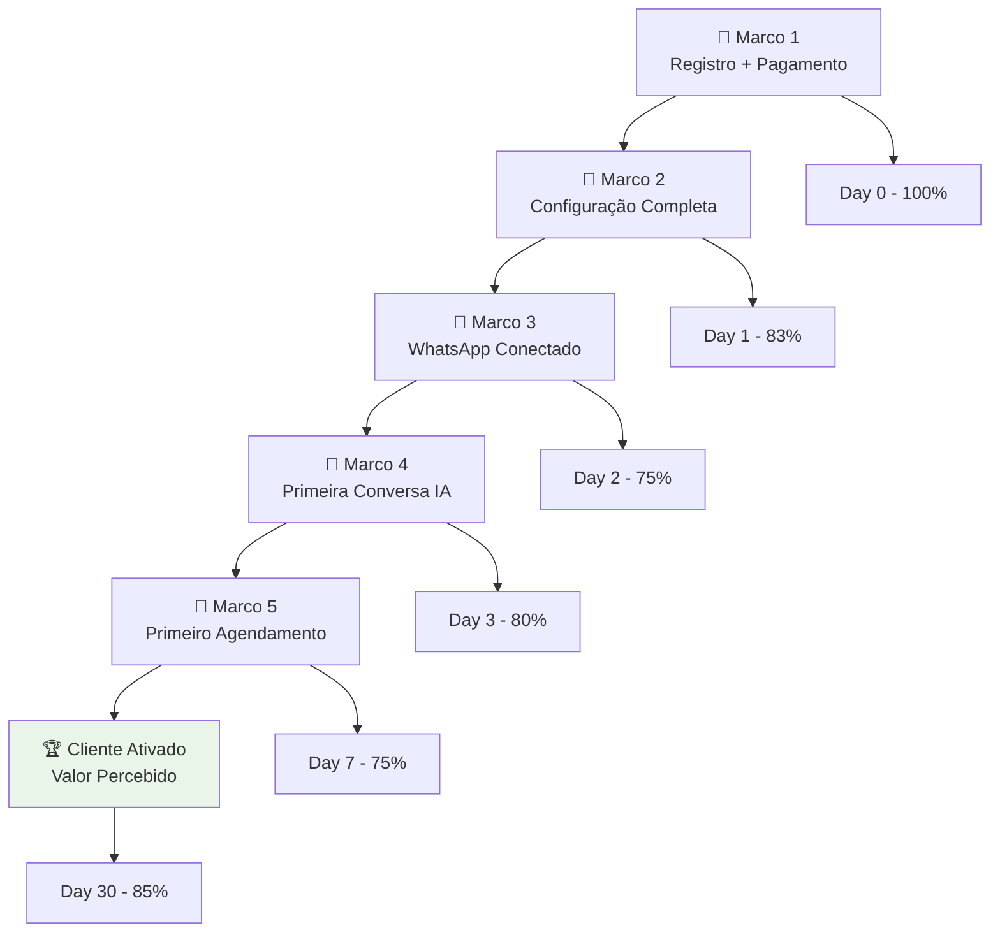

# 🎯 User Journey - Novo Cliente

## 📱 Jornada Completa do Cliente



## 🔄 Fluxo Técnico de Conversão



## 🎨 Touchpoints da Experiência



## 📊 Métricas de Conversão

```mermaid
graph LR
    A[1000 Visitantes<br/>Landing Page] --> B[300 Clicam<br/>"Começar"]
    B --> C[200 Preenchem<br/>Formulário]
    C --> D[150 Chegam<br/>Checkout]
    D --> E[120 Completam<br/>Pagamento]
    E --> F[100 Configuram<br/>Sistema]
    F --> G[80 Recebem<br/>1ª Conversa]
    G --> H[60 Fazem<br/>1º Agendamento]
    
    A --> A1[30% CTR]
    B --> B1[67% Completam]
    C --> C1[75% Avançam]
    D --> D1[80% Convertem]
    E --> E1[83% Ativam]
    F --> F1[80% Engajam]
    G --> G1[75% Valor]
    
    style E fill:#e8f5e8
    style H fill:#fff3e0
```

## 🎯 Personas e Segmentos



## ⏱️ Timeline de Ativação



## 🎭 Estados Emocionais



## 📞 Pontos de Contato



## 🏆 Marcos de Sucesso



## 💡 Insights e Otimizações

### 🔍 **Pontos de Fricção Identificados:**
1. **Conexão WhatsApp** - Processo técnico complexo
2. **Configuração inicial** - Muitas opções confundem
3. **Primeira conversa** - Expectativa vs realidade

### 🚀 **Oportunidades de Melhoria:**
1. **Onboarding guiado** - Wizard step-by-step
2. **Templates prontos** - Configuração rápida por segmento
3. **Simulador IA** - Teste antes da primeira conversa real

### 📊 **KPIs Críticos:**
- **Time to First Value:** 3 dias (primeiro agendamento)
- **Activation Rate:** 75% (uso regular em 30 dias)
- **Setup Completion:** 83% (configuração completa)

Este fluxo mapeia toda a jornada do cliente desde a descoberta até se tornar um usuário ativo, identificando pontos críticos para otimização da conversão e experiência.